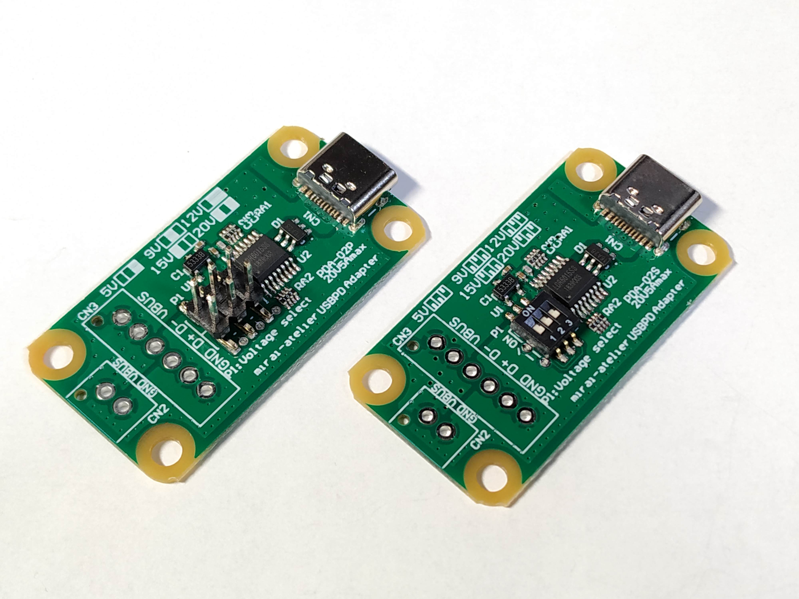
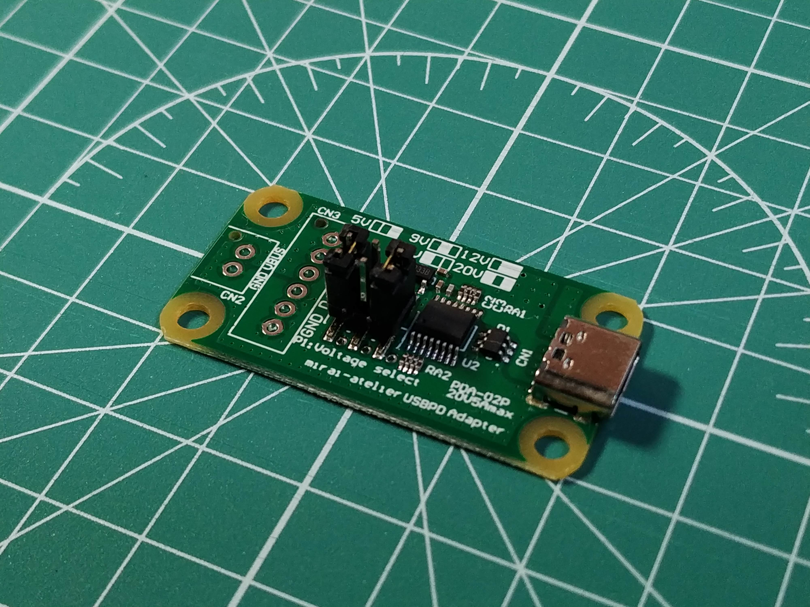
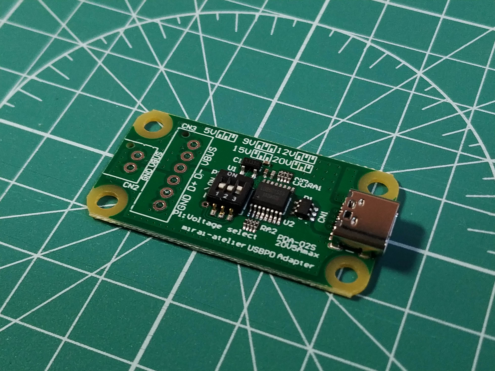
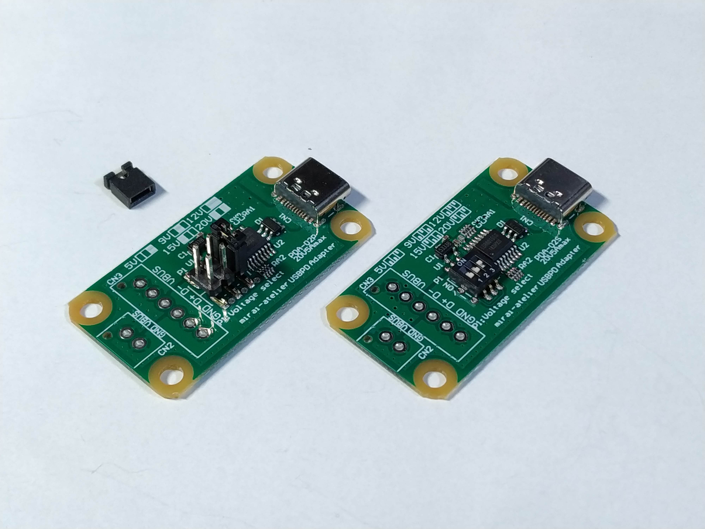
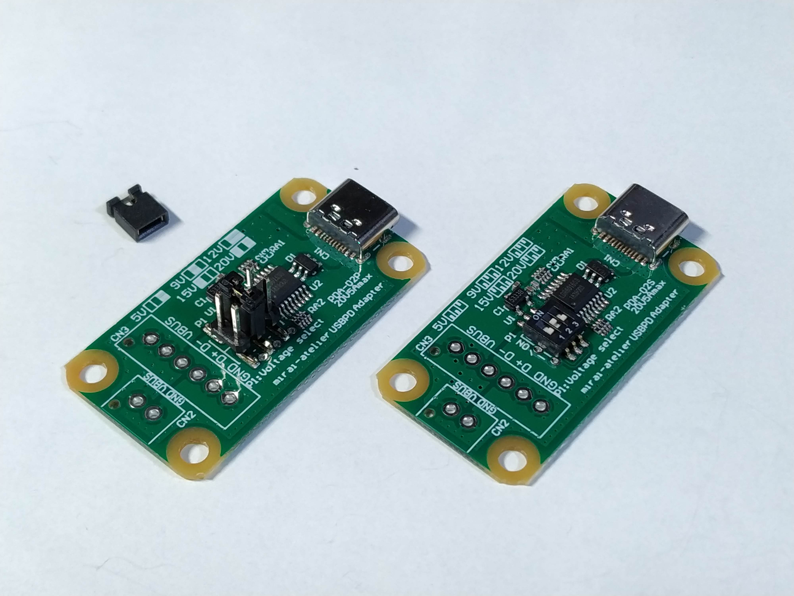
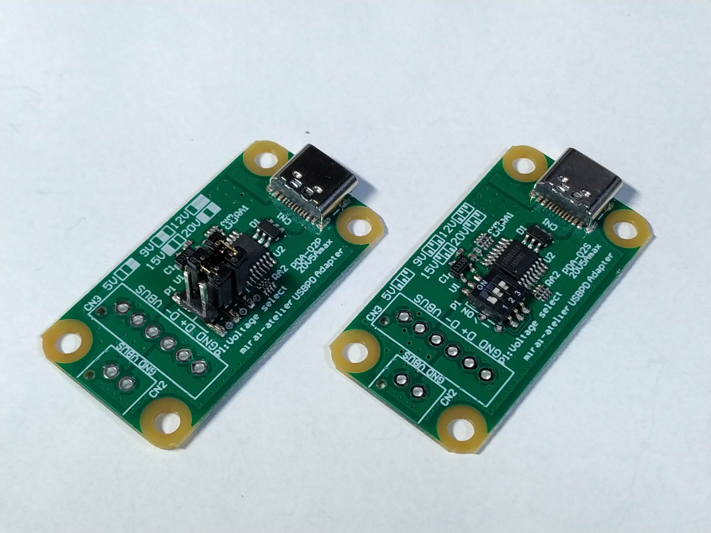
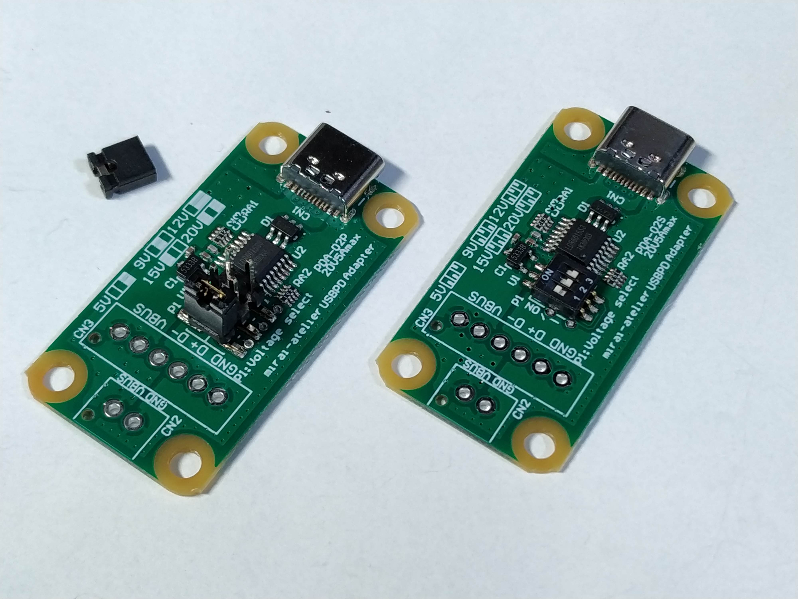
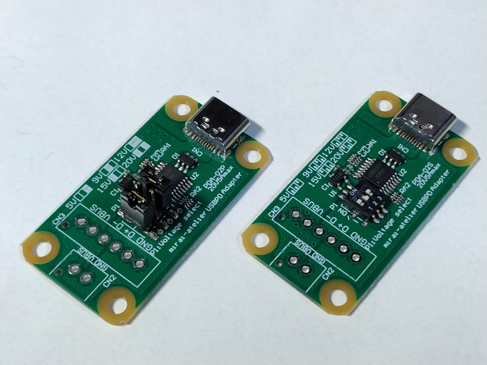

# USB-PD_Adapter PDA-02P/S
-PDから電圧ぶっこ抜く-

## これは何？
Mac book や ニンテンドーSwitch などの USB Type-C Power Derivery 対応のACアダプタやモバイルバッテリーのようなPDソース機器からPDOに従った任意の電源を取り出すためのモジュールです．

工作した機器の電源として市販のPD対応モバイルバッテリー等を使うことができるので安全に大容量のエネルギーを活用することができます．

USB2.0 の信号線も取り出すことができるので，既存のUSB機器などを簡単にPD対応させることができます．（USB2.0の動作を保証するものではありません）

鉛フリー，RoHS対応部品を使用しています．

## 旧製品PDA-01との違い
[PDA-01の仕様はこちら](https://github.com/betaEncoder/USB-PD_Adapter)をごらんください．  

- 5A対応
    - 最大で5Aの電流を取り出すことができるようになりました(PDA-01では3Aまで）
    - ただし，3Aを超える電流を取り出すためにはE-Marker内蔵のケーブルが必要です
- DIP-SW版をラインナップ
    - PDA-02**P**：PDA-01と同じピンヘッダとショートチップによる電圧設定  
    
    - PDA-02**S**：DIP-SWによる電圧設定(最大高さはUSBコネクタの3.1mm)  
    

## 注意
全ての USB PD ソース機器との接続や動作を保証するものではありません．

ケーブルを抜き差しする際はコネクタが真直ぐになるように取り扱い，こじらないようにしてください．機械的，電気的に本機を破損する恐れがあります．

USB PD 規格仕様により，VBUSに接続できる容量に制限があり，PDのネゴシエーション後で最大100uFです．大容量の負荷を接続した場合にPDソース機器が過電流保護を働かせる場合があります．その際には負荷側にロードスイッチや電流制限等を設けてください．

また，USB PD ソース機器が対応した電圧のみ取り出すことができます．設定した電圧が必ず取り出せるものではありません．

本機を用いて取り出せる電圧，電流は20V5Aまでです．

本機上には出力電圧や出力電流を制限する仕組みがありません．過負荷等により発熱する恐れがありますので，必ず出力電圧や電流を確認の上使用してください．PDの規格に準拠したソース機器であればPDOに合わせた電流制限などの保護機能があり，ショート等が起こっても安全である筈ですが，負荷に合わせた適切な保護機構を設けることをお勧めします．

電圧設定を誤ると接続先の機器を破損してしまう恐れがあります．よく確認してから電源を投入してください．製品へ組み込む際は利用者の責任において安全対策を行ったうえで管理・使用してください．

検査後に出荷しています．基板の取扱や接続する機器によって容易に破損する可能性があります．取扱には注意してください．

購入時期により画像とは使用部品等が異なる場合があります．

本機を使用したことによるいかなる損害については保証いたしかねます．

## 電圧設定方法
本機上のピンヘッダ若しくはDIP-SWよって電圧を設定できます．以下を参照してください．
ソース機器が非対応の電圧は取り出すことができません．

| ジャンパー位置 | 電圧 |
|:--------------|:----|
|     | 5V  |
|     | 9V  |
|     | 12V |
|     | 15V |
|     | 20V |
| その他        | 使用しません |

## CN2, CN3 について
電線を直接はんだ付けするほか，日本圧着端子製造(JST)のXHコネクタ又は2.54mmピッチのピンヘッダをはんだ付け可能です．  
XHコネクタはピンあたりの最大電流が3Aなので3Aを超える電流を取り出す場合はVBUSとGNDにそれぞれ2ピンづつ使う必要があります．

ハーネスを用いてVBUSとD+,D-を取り出すことができます．

コネクタやハーネスは付属していません．別途ご用意してください．

コネクタを予めはんだ付けされたものや，アプリケーションに合わせたカスタム品も提供可能です．大量購入などもメール(maruyamaあっとmirai-atelier.com)又はTwitter([@betaEncoder](https://twitter.com/betaEncoder))にてお問い合わせください．

## 基板サイズ(図面)
簡易的な図面と3Dモデルを用意しました．PDFと3Dモデル(STEP/PARASOLID)がダウンロード可能です．

このデータは寸法を保証するものではありません．参考値としてご利用ください．

- PDA-02P
    - [PDF](PDA-02P.PDF)
    - [STEP](PDA-02P.step)
    - [PARASOLID](PDA-02P.x_t)
- PDA-02S
    - [PDF](PDA-02S.PDF)
    - [STEP](PDA-02S.step)
    - [PARASOLID](PDA-02S.x_t)
